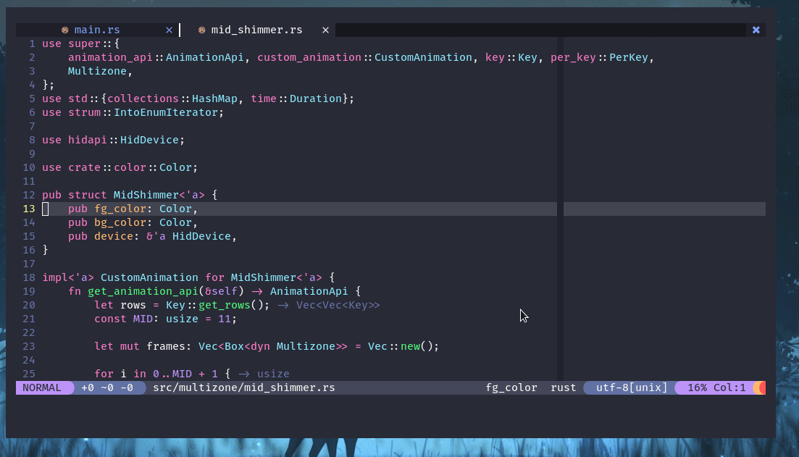

# rust-tools.nvim
Extra rust tools for writing applications in neovim using the native lsp.
This plugin adds extra functionality over rust analyzer. The features mirror VsCode.

## Prerequisites

- `neovim 0.5+` (nightly)
- `nvim-lspconfig`
- `rust-analyzer`

## Installation

using `vim-plug`

```vim
Plug 'neovim/nvim-lspconfig'
Plug 'simrat39/rust-tools.nvim'

" Optional dependencies
Plug 'nvim-lua/popup.nvim'
Plug 'nvim-lua/plenary.nvim'
Plug 'nvim-telescope/telescope.nvim'
```
<b>Look at the configuration information below to get started.</b>

# Configuration + Functionality

Please configure [`nvim-lspconfig for rust`](https://github.com/neovim/nvim-lspconfig/blob/master/CONFIG.md#rust_analyzer) before using this plugin.

This plugin is more of WYSIWYG right now but more configuration options will slowly be added.

### Initial setup
```lua
local opts = {
    -- All opts that go into runnables (scroll down a bit) can also go here,
    -- these apply to the default RustAnalyzerRunnables command
    runnables = {
        -- whether to use telescope for selection menu or not
        -- default: true
        use_telescope = true
        -- rest of the opts are forwarded to telescope
    },
    -- All opts that go into inlay hints (scroll down a bit) can also go here,
    -- these apply to the default RustAnalyzerSetInlayHints command
    inlay_hints = {
        -- wheter to show parameter hints with the inlay hints or not
        -- default: true
        show_parameter_hints = true,
    },
}

-- Call this in place of `require('lspconfig').rust_analyzer.setup`.
require('rust-tools').setup({
    server = {}, -- rust_analyzer options go here
    tools = {    -- rust-tools options go here
        -- All opts that go into inlay hints (scroll down a bit) can also go here,
        -- these apply to the default RustAnalyzerSetInlayHints command
        inlay_hints = {
            -- wheter to show parameter hints with the inlay hints or not
            -- default: true
            show_parameter_hints = true,
        },
    },
})
```

## Telescope extension
To use this plug-in with Telescope, load the `rust-tools` extension:
```lua
local telescope = require('telescope')

telescope.setup({
    extensions = {
        -- These are the default settings!
        ['rust-tools'] = {
            runnables = {
                telescope = {},
                no_results_message = 'No runnables found',
            },
            hover_actions = {
                telescope = {},
                no_results_message = 'No runnables found',
            },
        },
    },
})

telescope.load_extension('rust-tools')
```

One cool configuration is to use a dropdown for Telescope results:
```lua
local telescope = require('telescope')
local dropdown_theme = require('telescope.themes').get_dropdown({})

telescope.setup({
    extensions = {
        ['rust-tools'] = {
            runnables = {
                telescope = dropdown_theme,
            },
            hover_actions = {
                telescope = dropdown_theme,
            },
        },
    },
})

telescope.load_extension('rust-tools')
```

## Commands
```vim
RustAnalyzerSetInlayHints
RustAnalyzerRunnables
RustAnalyzerExpandMacro
RustAnalyzerOpenCargo 
RustAnalyzerParentModule
RustAnalyzerJoinLines
RustAnalyzerHoverActions
RustAnalyzerMoveItemDown
RustAnalyzerMoveItemUp
```

#### Inlay Hints

```lua
-- Command:
-- RustAnalyzerSetInlayHints
local opts = {
    -- whether to show parameter hints with the inlay hints or not
    -- default: true
    show_parameter_hints = true,
}

require('rust-tools.inlay_hints').set_inlay_hints(opts)
```

#### Runnables

```lua
-- Command:
-- RustAnalyzerRunnables
local opts = {
    -- whether to use telescope for selection menu or not
    -- default: true
    use_telescope = true
    -- rest of the opts are forwarded to telescope
}
require('rust-tools.runnables').runnables(opts)
```

#### Expand Macros Recursively 

```lua
-- Command:
-- RustAnalyzerExpandMacro  
require'rust-tools.expand_macro'.expand_macro()
```

#### Move Item Up/Down

```lua
-- Command:
-- RustAnalyzerMoveItemUp    
-- RustAnalyzerMoveItemDown    
local up = true -- true = move up, false = move down
require'rust-tools.move_item'.move_item(up)
```

#### Hover Actions

```lua
-- this needs the experimental hoverActions capability set
-- while configuring your rust-analyzer:
local capabilities = vim.lsp.protocol.make_client_capabilities()

capabilities.experimental = {}
capabilities.experimental.hoverActions = true

nvim_lsp.rust_analyzer.setup({
    capabilities = capabilities,
})
------------------------------------------------------------------
-- Actual call
-- Command:
-- RustAnalyzerHoverActions 
require'rust-tools.hover_actions'.hover_actions()
```

#### Open Cargo.toml

```lua
-- Command:
-- RustAnalyzerOpenCargo
require'rust-tools.open_cargo_toml'.open_cargo_toml()
```

#### Parent Module

```lua
-- Command:
-- RustAnalyzerParentModule 
require'rust-tools.parent_module'.parent_module()
```

#### Join Lines

```lua
-- Command:
-- RustAnalyzerJoinLines  
require'rust-tools.join_lines'.join_lines()
```

## Inspiration

This plugin draws inspiration from [`akinsho/flutter-tools.nvim`](https://github.com/akinsho/flutter-tools.nvim)
